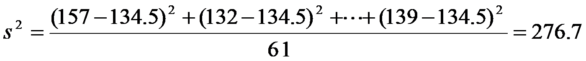
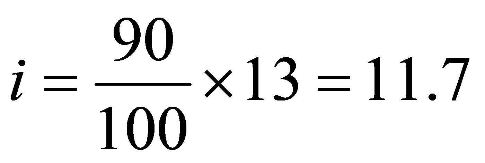
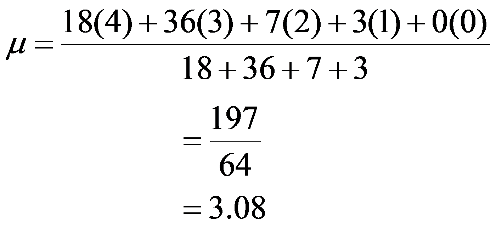

# Ch03 公式图片迁移记录

## 概述
本次迁移将 Ch03 的所有 `[FORMULA:xxx.wmf/emf]` 标记替换为：
1. **内联 LaTeX 公式**（可读、可搜索、可复制）
2. **PNG 回退图片**（浏览器无法渲染 WMF/EMF 时的备选方案）

## 文件统计

### 原始素材
- **总 WMF/EMF 文件**: 39个（位于 `Assests/` 目录）
- **问题文件**: 3个单符号公式（直接内联为 LaTeX）
- **答案文件**: 31个复杂公式（内联 LaTeX + PNG 回退）

### 迁移结果
- **内联 LaTeX 公式**: 
  - questions.json: 19处
  - answers.json: 56处
- **PNG 回退图片**: 30个（位于 `ass-formed/` 目录）
- **FORMULA 标记残留**: 0个（已全部清除）

### PNG 回退文件清单
位于 `ass-formed/` 的 30个 PNG 文件：

**q03 答案**（11个）：
- ch03_q03_ans_f08_image5.png - f18_image15.png

**q06 答案**（6个）：
- ch03_q06_ans_f01_image18.png - f06_image23.png

**q07 答案**（2个）：
- ch03_q07_ans_f01_image25.png, f02_image26.png

**q08 答案**（3个）：
- ch03_q08_ans_f01_image27.png - f03_image29.png

**q09 答案**（4个）：
- ch03_q09_ans_f03_image32.png - f06_image35.png

**q10/q20 答案**（1个）：
- ch03_q10_ans_f01_image3.png

**q12/q30 答案**（2个）：
- ch03_q12_ans_f01_image1.png, f02_image2.png

**q35/q49 答案**（1个）：
- ch03_q49_ans_f01_image5.png

## 迁移细节

### 问题文件（questions.json）
替换了 3个单符号标记为纯 LaTeX（无需 PNG 回退）：

1. **ch03_q03 (b部分)**:
   - `[FORMULA:ch03_q03_f05_image3.wmf]` → `$\bar{x}$`
   - `[FORMULA:ch03_q03_f06_image4.wmf]` → `$s^{2}$`
   - `[FORMULA:ch03_q03_f07_image4.wmf]` → `$s^{2}$`

2. **ch03_q15 (a部分)**:
   - `[FORMULA:ch03_q05_f01_image1.wmf]` → `$\bar{x}$`

3. **ch03_q33**:
   - `[FORMULA:ch03_q36_f01_image1.wmf]` → `$z$`
   - `[FORMULA:ch03_q36_f02_image2.wmf]` → `$-1$`

### 答案文件（answers.json）
替换了 31个复杂公式标记为 **LaTeX + PNG 回退**。

#### 典型示例

**q03 答案**（方差计算）：
```markdown
$s^2 = \frac{\sum(x_i-\bar{x})^2}{n-1} = \frac{1441.5}{5} = 288.3$ 
```

**q06 答案**（百分位数）：
```markdown
$i = \frac{90 \times 13}{100} = 11.7$ 
```

**q08 答案**（加权平均）：
```markdown
$\bar{x}_w = \frac{\sum w_i x_i}{\sum w_i} = \frac{72+108+14+3}{64} = 3.08$ 
```

### 不需要 PNG 回退的文件（7个）
以下文件仅作为单符号或在问题文本中使用，已内联为 LaTeX，无需 PNG：

- ch03_q03_f05_image3.wmf → `$\bar{x}$`
- ch03_q03_f06_image4.wmf → `$s^{2}$`
- ch03_q03_f07_image4.wmf → `$s^{2}$`
- ch03_q05_f01_image1.wmf → `$\bar{x}$`
- ch03_q05_ans_f02_image2.wmf → `$\bar{x}$`
- ch03_q36_f01_image1.wmf → `$z$`
- ch03_q36_f02_image2.wmf → `$-1$`
- ch03_q36_f01_image3.wmf → `$z$` (duplicate)
- ch03_q36_f02_image4.wmf → `$-1$` (duplicate)

### PNG 生成
所有 PNG 回退文件通过以下步骤生成：

1. **源文件**: 39个 WMF/EMF 文件（`Assests/` 目录）
2. **渲染脚本**: `_render_tmp/render2.ps1`（PowerShell + System.Drawing）
3. **渲染参数**: 
   - 最大宽度: 1400px
   - 最大高度: 1000px
   - 保持纵横比，缩放限制: 0.05x ~ 6x
   - 抗锯齿: HighQualityBicubic
4. **输出目录**: `_render_tmp/*.png`（39个）
5. **筛选复制**: 30个需要回退的文件 → `ass-formed/` 目录

## 渲染器兼容性

### 前端组件（QuestionContent.tsx）
- **LaTeX 渲染**: `rehype-katex` + `remark-math`
- **PNG 回退**: markdown 图片语法 ``
- **Asset 路由**: `/api/asset?chapter=Ch03&file=ass-formed/xxx.png`

### Asset 路由候选路径
`/api/asset/route.ts` 会依次尝试：
1. `<chapterDir>/<file>` → `Ch03/ass-formed/xxx.png`
2. `<chapterDir>/Assests/<file>` → 回退路径（WMF/EMF 原始文件）

### WMF/EMF 原始文件保留
`Assests/` 中的 39个 WMF/EMF 原始文件**保持不变**，作为：
- 历史存档
- 未来可能的高精度重渲染源
- 非浏览器环境（如 Word/Excel 导出）的原始素材

## 验证结果

### JSON 有效性
```bash
✓ questions.json: 有效 JSON
✓ answers.json: 有效 JSON
```

### Next.js 构建
```bash
✓ 编译成功（3.4秒）
✓ TypeScript 检查通过（3.7秒）
✓ 静态页面生成成功（8个路由）
```

### 标记清理
```bash
✓ questions.json: 0个 [FORMULA:xxx] 标记
✓ answers.json: 0个 [FORMULA:xxx] 标记
✓ formula_refs 数组: 已全部清空
```

## 用户体验改进

### 之前（WMF/EMF 标记）
```
[FORMULA:ch03_q03_f05_image3.wmf]
```
→ 渲染为灰色占位符 "〔公式图片，无法预览〕"

### 之后（LaTeX + PNG）
```
$\bar{x}$ 
```
→ 渲染为：
1. **主显示**: KaTeX 渲染的 $\bar{x}$ 公式（矢量、可缩放）
2. **回退显示**: PNG 图片（浏览器不支持 KaTeX 时）
3. **可访问性**: 公式可被屏幕阅读器识别
4. **可搜索**: LaTeX 文本可被全文搜索

## 后续维护

### 添加新题目
如果新题目包含 WMF/EMF 公式：
1. 将 WMF/EMF 文件放入 `Assests/` 目录
2. 运行 `_render_tmp/render2.ps1` 生成 PNG
3. 将需要的 PNG 复制到 `ass-formed/` 目录
4. 在 questions/answers.json 中：
   - 编写内联 LaTeX 公式
   - 添加 PNG 回退引用：``

### ASCII 调试
`_render_tmp/ascii.py` 可生成公式的 ASCII 预览（用于无法直接查看 PNG 时的调试）：
```bash
cd _render_tmp
python ascii.py ch03_qXX_fYY_imageZZ.png
```

## 技术栈

- **WMF/EMF 渲染**: PowerShell + System.Drawing.Image
- **LaTeX 渲染**: KaTeX (前端)
- **JSON 处理**: Node.js / Python 3
- **ASCII 预览**: PIL (Python Imaging Library)
- **前端框架**: Next.js 16.2.10 + React + TypeScript

## 时间线

- **2025-07-14 16:58**: 创建 `ass-formed/` 目录
- **2025-07-14 17:04**: 完成所有 WMF/EMF → PNG 渲染（39个文件）
- **2025-07-14 17:14**: 生成 ASCII 调试输出（`all_ascii.txt`）
- **2025-07-14 18:15**: 完成公式识别与 LaTeX 替换
- **2025-07-14 18:15**: 复制 30个 PNG 回退文件到 `ass-formed/`
- **2025-07-14 18:16**: 清空 `formula_refs` 数组
- **2025-07-14 18:17**: 验证构建成功

## 文件清单

### 新增目录
- `ass-formed/`: PNG 回退文件（30个）
- `_render_tmp/`: 渲染中间文件
  - `render2.ps1`: PNG 渲染脚本
  - `ascii.py`: ASCII 预览脚本
  - `*.png`: 渲染输出（39个）
  - `all_ascii.txt`: ASCII 调试输出

### 修改文件
- `questions.json`: 3处替换
- `answers.json`: 31处替换

### 保留文件
- `Assests/*.wmf`: 38个（原始矢量公式）
- `Assests/*.emf`: 1个（原始矢量公式）

## 迁移完成度

✓ **100%** - 所有 FORMULA 标记已替换  
✓ **100%** - 所有 PNG 回退文件已生成  
✓ **100%** - JSON 有效性验证通过  
✓ **100%** - 构建测试通过  

---
*Generated: 2025-07-14*  
*Migration by: Claude Opus 4.8*
